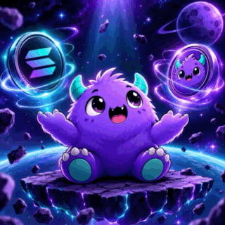

# xnova gitbook $xnova

<figure><figcaption></figcaption></figure>

A focused Solana ecosystem built around the XNOVA wallet experience, token access, market discovery and community infrastructure.

<a href="https://xnovaterminal.lovable.app/" class="button primary">Launch Wallet</a> <a href="https://xnovasolanax.lovable.app/" class="button secondary">Explore Website</a>

## Overview

## One ecosystem. One identity.

XNOVA brings its wallet, token, market resources and community channels into a single documentation layer.

|      |                    |
| ---- | ------------------ |
| 1B   | Total XNOVA supply |
| SOL  | Native ecosystem   |
| 24/7 | Community access   |

### XNOVA Wallet

The wallet application is the primary product interface for interacting with XNOVA-related resources and the broader Solana ecosystem.

[Open XNOVA Wallet →](https://xnovaterminal.lovable.app/)

### Built for discovery

Connect project information, token resources and market visibility without unnecessary friction.

## Tokenomics

## Simple supply structure.

Core token information presented clearly for community members, users and ecosystem participants.

| Metric        | Value                                        | Notes                                        |
| ------------- | -------------------------------------------- | -------------------------------------------- |
| Total Supply  | **1,000,000,000 XNOVA**                      | Fixed project-stated supply                  |
| Network       | Solana                                       | SPL ecosystem                                |
| Owner Holding | \~$1 worth                                   | Project-provided disclosure; verify on-chain |
| Mint / Token  | 9RwukCBfqoXb4XaqDvchKs8LhSmbbdcVik1S9h47pump | Verify before interacting                    |
| Pair          | 6XwPJSsCvHpMaiGZstCbm95RmBMQMZpErRYSXfsPyNhT | Market pair reference                        |

### Transparency

The owner states that their personal holding is limited to approximately $1 worth of XNOVA at the stated reference value.

### Verification

Token balances, liquidity, price and ownership can change. Always verify current on-chain data before making decisions.

### Market Access

[Pump.fun](https://pump.fun/coin/9RwukCBfqoXb4XaqDvchKs8LhSmbbdcVik1S9h47pump) and [DEX Screener](https://dexscreener.com/solana/6xwpjsscvhpmaigzstcbm95rmbmqmzperrysxfspynht) provide market references.

## Roadmap

## Build → expand → connect.

A living roadmap focused on product quality, ecosystem utility and community growth.



### Foundation

* Launch ecosystem identity
* Establish XNOVA token
* Launch wallet experience
* Publish documentation



### Wallet

* Improve UX
* Expand Solana asset visibility
* Portfolio improvements
* Security & reliability



### Community

* Grow global channels
* Community initiatives
* Educational resources
* Partnerships



### Ecosystem

* Advanced wallet tools
* New integrations
* Analytics & discovery
* Community-led expansion



## Community

##

<figure><figcaption></figcaption></figure>

##

## Find XNOVA everywhere.

Official channels and project resources.

* [XNOVA Wallet APP →](https://xnovaterminal.lovable.app/)
* [Official Website WEB →](https://xnovasolanax.lovable.app/)
* [Telegram COMMUNITY →](https://t.me/XNOVASOLANAMARKET)
* [X / Twitter @xnovasolana SOCIAL →](https://x.com/xnovasolana)
* [Discord COMMUNITY →](https://discord.gg/WgFnMJzkAs)
* [Pump.fun MARKET →](https://pump.fun/coin/9RwukCBfqoXb4XaqDvchKs8LhSmbbdcVik1S9h47pump)
* [DEX Screener PAIR →](https://dexscreener.com/solana/6xwpjsscvhpmaigzstcbm95rmbmqmzperrysxfspynht)


**Risk & transparency notice:** XNOVA documentation is informational only and is not financial, investment, legal or tax advice. Cryptocurrency markets are volatile. Independently verify token addresses, balances, liquidity, ownership and other on-chain information before interacting with the token or ecosystem.

